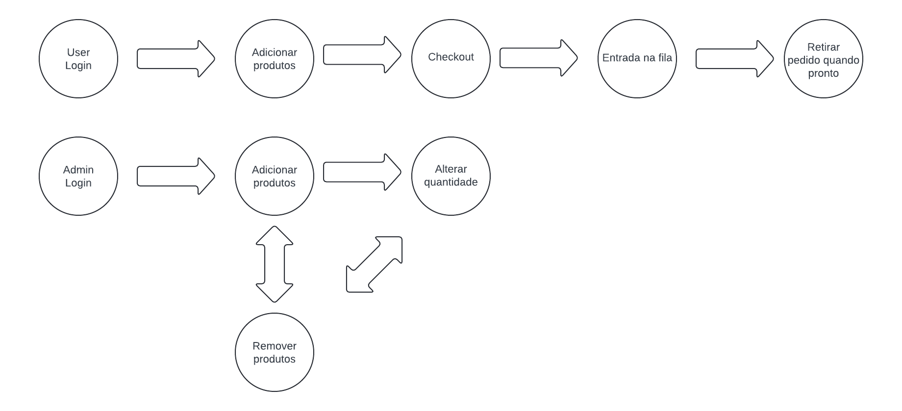
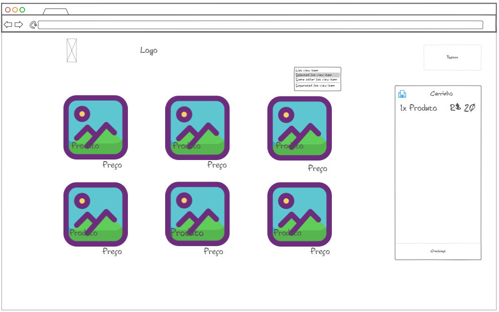

# Informações do Projeto
# Cantina Express

`CURSO` 

Engenharia de Software

## Participantes

- Fernando Rodrigues da Mata
- Manoel Rodrigues Bezerra Neto

# Estrutura do Documento

- [Informações do Projeto](#informações-do-projeto)
  - [Participantes](#participantes)
- [Estrutura do Documento](#estrutura-do-documento)
- [Introdução](#introdução)
  - [Problema](#problema)
  - [Objetivos](#objetivos)
  - [Justificativa](#justificativa)
  - [Público-Alvo](#público-alvo)
- [Especificações do Projeto](#especificações-do-projeto)
  - [Personas e Mapas de Empatia](#personas-e-mapas-de-empatia)
  - [Histórias de Usuários](#histórias-de-usuários)
  - [Requisitos](#requisitos)
    - [Requisitos Funcionais](#requisitos-funcionais)
    - [Requisitos não Funcionais](#requisitos-não-funcionais)
  - [Restrições](#restrições)
- [Projeto de Interface](#projeto-de-interface)
  - [User Flow](#user-flow)
  - [Wireframes](#wireframes)
- [Metodologia](#metodologia)
  - [Divisão de Papéis](#divisão-de-papéis)
  - [Ferramentas](#ferramentas)
  - [Controle de Versão](#controle-de-versão)
- [Projeto da Solução](#projeto-da-solução)
  - [Tecnologias Utilizadas](#tecnologias-utilizadas)
  - [Arquitetura da solução](#arquitetura-da-solução)
- [Avaliação da Aplicação](#avaliação-da-aplicação)
  - [Plano de Testes](#plano-de-testes)
  - [Registros de Testes](#registros-de-testes)
- [Referências](#referências)

# Introdução

## Problema

O problema que o nosso software visa resolver é o longo tempo de espera e a falta de eficiência no processo de atendimento da cantina. Muitas vezes, em ambientes com grande fluxo de pessoas, tornam as filas na cantina podem se tornar excessivamente longas, resultando em atrasos no horário de refeição, frustração dos clientes e até mesmo perda de receita para a cantina.

Alguns dos principais problemas enfrentados são:

1. **Longas filas de espera**: Os clientes precisam esperar por um longo tempo para fazer seus pedidos, o que pode levar à insatisfação e ao desinteresse em utilizar os serviços da cantina.

2. **Tempo de espera imprevisível**: A falta de previsibilidade no tempo de espera pode levar os clientes a evitar a cantina ou a se dirigirem para ela em horários de pico, tornando o problema ainda pior.

3. **Desorganização no atendimento**: A falta de um sistema eficiente de gestão de filas pode levar a confusões no atendimento, erros nos pedidos e atrasos na entrega das refeições.

4. **Baixa utilização dos recursos**: Em momentos de baixa demanda, os recursos da cantina, como pessoal e equipamentos, podem estar subutilizados, enquanto em horários de pico podem estar sobrecarregados.

Ao abordar esses problemas, o software busca melhorar a experiência dos clientes na cantina, reduzindo os tempos de espera, aumentando a eficiência do atendimento e garantindo uma distribuição mais equilibrada dos recursos disponíveis.

## Objetivos

1. **Reduzir o tempo de espera**: O principal objetivo é diminuir significativamente o tempo que os clientes passam na fila da cantina, tornando o processo de compra mais rápido e eficiente.

2. **Aumentar a satisfação do cliente**: Busca-se garantir que os clientes tenham uma experiência mais agradável ao utilizar os serviços da cantina, minimizando a frustração causada por longas filas e tempos de espera imprevisíveis.

3. **Otimizar a utilização de recursos**: Pretende-se garantir que os recursos da cantina, como pessoal, equipamentos e matéria-prima, sejam utilizados de forma eficiente, evitando ociosidade em momentos de baixa demanda e sobrecarga em horários de pico.

4. **Proporcionar previsibilidade no atendimento**: O software deve fornecer aos clientes informações claras sobre o tempo de espera estimado na fila, ajudando-os a planejar melhor seus horários de refeição e evitando surpresas desagradáveis.

5. **Facilitar a gestão da cantina**: Além de melhorar a experiência do cliente, o software também deve facilitar a gestão interna da cantina, fornecendo dados e métricas úteis para monitorar o desempenho do atendimento, prever a demanda futura e tomar decisões estratégicas.

Esses objetivos visam não apenas resolver o problema imediato das longas filas na cantina, mas também proporcionar benefícios a longo prazo, tanto para os clientes quanto para a própria equipe da cantina e a administração do local onde o software será implementado.

## Justificativa

Trabalhar com a aplicação de otimização da fila da cantina é importante por várias razões:

1. **Melhoria da experiência do cliente**: Ao reduzir o tempo de espera e proporcionar uma experiência mais eficiente na cantina, podemos aumentar a satisfação dos clientes. Isso não só os torna mais propensos a utilizar os serviços da cantina novamente, mas também pode gerar uma percepção positiva da instituição como um todo.

2. **Aumento da eficiência operacional**: Uma cantina mais eficiente não só beneficia os clientes, mas também a equipe que trabalha nela. Ao otimizar a utilização de recursos e simplificar os processos de atendimento, podemos melhorar a produtividade da equipe e reduzir o estresse associado a picos de demanda.

3. **Redução de custos**: A utilização mais eficiente de recursos pode levar a uma redução nos custos operacionais da cantina, seja pela redução de horas extras da equipe, pelo melhor aproveitamento de ingredientes ou pela minimização de desperdícios.

4. **Análise de dados para tomada de decisão**: Implementar um software de gestão de filas permite coletar dados valiosos sobre o comportamento dos clientes, padrões de consumo e desempenho operacional da cantina. Esses dados podem ser usados para identificar tendências, prever demandas futuras e tomar decisões estratégicas mais embasadas.

5. **Competitividade e reputação institucional**: Em um mercado cada vez mais competitivo, oferecer serviços de alimentação eficientes e satisfatórios pode ser um diferencial importante para atrair e reter alunos, funcionários ou clientes. Uma cantina bem gerenciada contribui para a reputação positiva da instituição.

Ao escolher os objetivos específicos para o projeto, focamos em resolver os problemas mais prementes identificados no processo de atendimento da cantina, visando não apenas a satisfação imediata dos clientes, mas também benefícios a longo prazo para a instituição e seus stakeholders.

## Público-Alvo

Para entender melhor os diferentes perfis de usuários da aplicação de otimização da fila da cantina, podemos identificar os seguintes grupos:

1. **Clientes da Cantina**:
   - **Alunos**: Podem variar desde crianças em idade escolar até jovens universitários. Podem ter diferentes níveis de familiaridade com a tecnologia, com alguns sendo muito proficientes em dispositivos móveis e aplicativos, enquanto outros podem ter menos experiência.
   - **Funcionários e professores**: Podem ter uma ampla gama de idades e habilidades tecnológicas. Alguns podem ser proficientes no uso de tecnologia, enquanto outros podem precisar de mais orientação.
   - **Visitantes/eventuais**: Pessoas que ocasionalmente utilizam os serviços da cantina, como pais em eventos escolares ou convidados em eventos corporativos.

2. **Equipe da Cantina**:
   - **Atendentes/caixas**: Responsáveis por operar o sistema de atendimento e registrar os pedidos dos clientes. Eles podem precisar de treinamento para usar o software de forma eficaz.
   - **Gerentes/supervisores**: Responsáveis por monitorar o desempenho da cantina, ajustar a operação conforme necessário e analisar os dados coletados pelo software. Eles podem precisar de acesso a ferramentas de análise de dados mais avançadas.

3. **Administradores da Instituição**:
   - **Diretores/gestores escolares**: Responsáveis pela administração geral da instituição. Eles podem estar interessados nos dados coletados pelo software para tomar decisões sobre alocação de recursos e políticas relacionadas à cantina.
   - **Equipe de TI**: Responsável pela manutenção e suporte técnico do software. Eles precisam garantir que o sistema seja confiável, seguro e fácil de usar para todos os usuários.

Esses perfis de usuários variam em termos de conhecimento prévio sobre tecnologia, nível de experiência e relações hierárquicas dentro da instituição. Portanto, é importante projetar a aplicação de forma a ser acessível e intuitiva para todos os usuários, independentemente de seu nível de familiaridade com a tecnologia.
 
# Especificações do Projeto

Nosso projeto visa a elaboração de um software cuja funcionalidade é resolver o problema de congestionamento do atendimento das cantinas, evitando longas e demoradas filas, e também, problemas com a acertividade no momento da entrega do pedido. Utilizamos algumas técninas para o desenvolvimento da ideia como, por exemplo, entrevistas para entender as experiências de clientes e também de funcionários da cantina. Tendo isso em vista, através de nossas analises, fomos incrementando ao projeto ideias e sugestões do público, uma vez que, serão estes os beneficiados da iniciativa. Além de entrevistas, fizemos reuniões para discussão de sugestões dos participantes para que, através de análises críticas buscarmos o consenso sobre o que é mais vantajoso e coerente ao projeto. Ademais, em sequência, elaboramos ideias visuais para o software juntamente de funções que irão operar neste, visando assim, chegar em um produto minimamente viável (protótipo), para ver se é funcional, se tem muitos bugs e se atende a demanda da situação.

## Personas e Mapas de Empatia

Relação da Persona com seu Mapa de Empatia
Visão: A visão de Rafaela é impactada pela constante exposição a ambientes tecnologicamente avançados e inspiradores, o que molda suas expectativas e preferências.
Audição: Ela é influenciada por fontes que valorizam a inovação e a eficiência, o que a motiva a buscar soluções que economizem tempo e melhorem a experiência de vida.
Pensamentos e sentimentos: Seus sonhos e preocupações reforçam seu desejo por ferramentas que a ajudem a alcançar seus objetivos mais rapidamente e com maior eficácia.
Fala e ações: O que Rafaela fala e faz reflete seu interesse em aplicar soluções práticas e eficientes em seu dia a dia, o que deve ser considerado ao desenvolver produtos que atendam a essas necessidades.
Dores e necessidades: Suas dores, como a frustração com ineficiências e a preocupação com o gerenciamento de tempo, podem ser diretamente abordadas com produtos que oferecem conveniência e economia de tempo, como o software de gerenciamento de filas da cantina.

Visão: O ambiente visual de Marcos é dominado por elementos de tecnologia e gaming, o que influencia suas preferências e comportamento de compra.
Audição: Ele é constantemente influenciado por vozes dentro da comunidade de tecnologia e gaming, o que molda suas aspirações e escolhas.
Pensamentos e sentimentos: Os sonhos e preocupações de Marcos direcionam seu interesse por soluções que maximizem o uso eficiente do tempo e da tecnologia.
Fala e ações: O que Marcos fala e faz reflete uma vida integrada com a tecnologia e jogos, indicando a necessidade de produtos e serviços que se alinhem com essa paixão.
Dores e necessidades: As dores de Marcos, como a preocupação com o tempo e a frustração com ineficiências, são áreas chave onde serviços eficientes podem atrair sua atenção e resolver seus problemas específicos.

Visão: A visão de Maria é constantemente influenciada por ambientes educativos e naturais, o que reforça a importância de soluções que respeitem e promovam a sustentabilidade.
Audição: Influenciada por vozes que priorizam a educação e a sustentabilidade, suas escolhas são moldadas por esses valores.
Pensamentos e sentimentos: Os sonhos e preocupações de Maria destacam sua necessidade de ferramentas que facilitam a implementação de práticas educacionais e sustentáveis.
Fala e ações: As conversas e ações de Maria refletem seu compromisso com a educação e a jardinagem, indicando que ela valoriza produtos e serviços que suportem esses interesses.
Dores e necessidades: As dores de Maria, relacionadas à gestão do tempo e à implementação de seus projetos, são cruciais para entender como serviços eficientes podem resolver seus problemas específicos.

## Histórias de Usuários

Com base na análise das personas forma identificadas as seguintes histórias de usuários:

|   EU COMO... `PERSONA`       | QUERO/PRECISO ... `FUNCIONALIDADE` |PARA ... `MOTIVO/VALOR`                 |
|------------------------------|------------------------------------|----------------------------------------|
|Cliente                       | Boa interface                                                              | Não haver problemas na hora de fazer e concluir o pedido    |
|Funcionário da cantina        | Ter acesso a lista de pedidos de forma ordenada pela hora da solicitação   | Poder se organizarem e montarem os pedidos corretamente |
|Proprietário da cantina       | Ter acesso a propriedade de edição das funcionalidades/serviços da cantina | Manter atualizado o cardápio e serviços |
|Gestor de software            | Editar permissões e linhas de código                                       | Realizar a manutenção do site, garantindo boa funcionalidade |

## Requisitos

As tabelas que se seguem apresentam os requisitos funcionais e não funcionais que detalham o escopo do projeto.

### Requisitos Funcionais

|ID    | Descrição do Requisito  | Prioridade |
|------|---------------------------------------------------|-------|
|RF-001| Permitir que o usuário se cadastre                | ALTA  |
|RF-002| Permitir que o usuário realize um pedido          | ALTA  |
|RF-003| Permitir que o usuário faça login                 | ALTA  |
|RF-004| Administrar disponibilidade do cardápio           | MÉDIA |

### Requisitos não Funcionais

|ID     | Descrição do Requisito  |Prioridade |
|-------|-------------------------|----|
|RNF-001| O sistema deve ser formulado da maneira mais rápida possível para beneficio do usuário | ALTA |
|RNF-002| O sistema deve ser responsivo para rodar em um dispositivos móvel | MÉDIA |
|RNF-003| Deve processar requisições do usuário em no máximo 3s |  BAIXA |

## Restrições

O projeto está restrito pelos itens apresentados na tabela a seguir.

|ID| Restrição                                             |
|--|-------------------------------------------------------|
|01| O projeto deverá ser entregue até o final do semestre |
|02| Não pode ser desenvolvido um módulo de backend        |

# Projeto de Interface

## User Flow

## Wireframes

# Metodologia

Nosso grupo optou pela divisão das partes do trabalho entre os membros do grupo, de modo a tornar sua execução mais rápida, visto que, simultaneamente, varias pessoas progrediam ao resolver partes diferentes do trabalho. Utilizamos o Figma para elaboração das ideias de interfaces apresentadas, o Miro para desenvolver nosso Design Thinking (que incluiu Matriz CSD, Mapa de Stakeholders, Diagrama de Personas, Mural de Possibilidades e Mapa de Priorização) sobre diversos aspectos do trabalho e Word para rascunho de ideias. A implementação das ideias no github foram feitas através do seguinte processo, todos fizeram arquivos com suas respectivas partes respondidas e enviaram no grupo para que tudo fosse compactado em um arquivo só, que foi usado como consulta para as respostas postas no github por um só membro do grupo durante uma reunião com a participação de todos.

## Divisão de Papéis

- Produção da capa e do entendimento 1 e 2: Manoel
- Produção do entendimento 3, 4 e 5: Fernando
- Etapa de exploração: Grupo todo
- Slides: Grupo todo
- Github: Manoel e Fernando.
- Documentação do projeto (PDF): Grupo todo

## Ferramentas

| Ambiente  | Plataforma              |Link de Acesso |
|-----------|-------------------------|---------------|
|Processo de Design Thinkgin  | Miro |  [https://miro.com/app/board/uXjVNiWtY6Q=](https://miro.com/app/board/uXjVNiWtY6Q=) | 
|Repositório de código | GitHub | [https://github.com/ICEI-PUC-Minas-PMGES-TI/pmg-es-2024-1-ti1-2401100-g5-fila-da-cantina](https://github.com/ICEI-PUC-Minas-PMGES-TI/pmg-es-2024-1-ti1-2401100-g5-fila-da-cantina) | 
|Hospedagem do site | Heroku |  https://XXXXXXX.herokuapp.com | 
|Protótipo Interativo | MavelApp ou Figma | https://www.figma.com/file/DSOpo60pZzlnmsfKpcPWBX/Cantina-Express?type=design&node-id=2%3A112&mode=design&t=Sdg7IsGcFkNomfZM-1 |
|Ferramentas de comunicação | Discord | https://discord.gg
|Editor de código | Visual Studio Code e Intelijj IDEA | https://code.visualstudio.com/ e https://www.jetbrains.com/idea/

## Controle de Versão

Serão utilizadas a branch **master** para o código final e a branch **dev** para testes.

# Projeto da Solução

......  COLOQUE AQUI O SEU TEXTO ......

## Tecnologias Utilizadas

### HTML
Construção de interfaces.
### TailwindCSS
Agilidade para desenvolvimento dos estilos.
### Javascript & jQuery
Manipulação da DOM para deixar o projeto funcional.
### PouchDB
Persistência de dados in-memory para tornar o projeto fiel ao seu objetivo.
### Node.js & Express
Lidar com requisições e entregar respostas para o cliente.
### MercadoPago SDK
Simular um checkout real durante a realização de um pedido.

## Arquitetura da solução

......  COLOQUE AQUI O SEU TEXTO E O DIAGRAMA DE ARQUITETURA .......

> Inclua um diagrama da solução e descreva os módulos e as tecnologias
> que fazem parte da solução. Discorra sobre o diagrama.
> 
> **Exemplo do diagrama de Arquitetura**:
> 
> 

# Avaliação da Aplicação

......  COLOQUE AQUI O SEU TEXTO ......

> Apresente os cenários de testes utilizados na realização dos testes da
> sua aplicação. Escolha cenários de testes que demonstrem os requisitos
> sendo satisfeitos.

## Plano de Testes

### Funcionalidades Avaliadas
1. **Registro de Usuário**
   - **Descrição**: Teste da funcionalidade de registro de novos usuários no sistema.
   - **Objetivo**: Verificar se o processo de registro é intuitivo e funcional.
   - **Resultados Esperados**: Usuário deve ser capaz de se registrar com sucesso utilizando um email válido.

2. **Login de Usuário**
   - **Descrição**: Teste da funcionalidade de login de usuários existentes.
   - **Objetivo**: Garantir que os usuários possam acessar suas contas de maneira segura e rápida.
   - **Resultados Esperados**: Usuário deve conseguir fazer login utilizando credenciais válidas.

3. **Visualização do Cardápio**
   - **Descrição**: Teste da funcionalidade de visualização do cardápio disponível na cantina.
   - **Objetivo**: Assegurar que o cardápio é exibido corretamente e atualizado conforme necessário.
   - **Resultados Esperados**: Usuário deve ser capaz de visualizar todos os itens disponíveis no cardápio.

4. **Pedido Antecipado**
   - **Descrição**: Teste da funcionalidade de realizar pedidos antecipados.
   - **Objetivo**: Verificar se os usuários conseguem fazer pedidos antecipados e se os mesmos são processados corretamente.
   - **Resultados Esperados**: Usuário deve conseguir realizar um pedido antecipado e receber confirmação do pedido.

### Grupo de Usuários Participantes
1. **Estudantes**
   - **Descrição**: Estudantes de várias disciplinas e anos que utilizam a cantina regularmente.
   - **Objetivo**: Avaliar a funcionalidade do sistema em um ambiente real com uso frequente.

2. **Professores**
   - **Descrição**: Professores que utilizam a cantina durante seus intervalos.
   - **Objetivo**: Garantir que o sistema atenda às necessidades dos professores que têm horários de intervalo limitados.

3. **Gestores da Cantina**
   - **Descrição**: Gestores responsáveis pela operação diária da cantina.
   - **Objetivo**: Avaliar a eficácia do sistema na administração dos pedidos e no gerenciamento da fila.

## Registros de Testes

### Teste 1: Registro de Usuário

**Funcionalidade**: Registro de novos usuários

**Passos Realizados**:
1. Navegar para a página de registro.
2. Preencher o formulário de registro com um email válido, código de pessoa, nome e uma senha.
3. Clicar no botão "Registrar".
4. Verificar a mensagem de confirmação de registro.

**Resultados Esperados**:
- O sistema deve exibir uma mensagem de confirmação indicando que o registro foi bem-sucedido.

**Resultados Obtidos**:
- A mensagem foi exibida conforme esperado.

**Status**: Aprovado

### Teste 2: Login de Usuário

**Funcionalidade**: Login de usuários existentes

**Passos Realizados**:
1. Navegar para a página de login.
2. Preencher o formulário de login com um email e senha válidos.
3. Clicar no botão "Login".
4. Criação da sessão do usuário.
5. Verificar o redirecionamento para a página inicial.

**Resultados Esperados**:
- O sistema deve redirecionar o usuário para a página inicial e exibir o cardápio.

**Resultados Obtidos**:
- O usuário foi redirecionado para a página inicial e foi exibido o cardápio.

**Status**: Aprovado

### Teste 3: Visualização do Cardápio

**Funcionalidade**: Visualização do cardápio disponível

**Passos Realizados**:
1. Navegar para a página de cardápio.
2. Verificar a exibição de todos os itens do cardápio.
3. Verificar a atualização do cardápio.

**Resultados Esperados**:
- Todos os itens do cardápio devem ser exibidos corretamente.
- O cardápio deve refletir as atualizações recentes.

**Resultados Obtidos**:
- Todos os itens do cardápio foram exibidos corretamente e as atualizações foram refletidas conforme esperado.

**Status**: Aprovado

### Teste 4: Pedido Antecipado

**Funcionalidade**: Realização de pedidos antecipados

**Passos Realizados**:
1. Navegar para a página de cardápio.
2. Selecionar um item e adicionar ao carrinho.
3. Navegar para o carrinho e clicar em "Finalizar Pedido".
4. Ser redirecionado para o checkout do Mercado Pago.

**Resultados Esperados**:
- Ser redirecionado para o checkout do Mercado Pago para a realização do pagamento.

**Resultados Obtidos**:
- Usuário foi redirecionado com sucesso.

**Status**: Aprovado

# Referências

- W3Schools. Disponível em: https://www.w3schools.com/. Acesso em: 30 jun. 2024.
- jQuery API Documentation. Disponível em: https://api.jquery.com/. Acesso em: 30 jun. 2024.
- PouchDB API Documentation. Disponível em: https://pouchdb.com/api.html. Acesso em: 30 jun. 2024.
- Mercado Pago Developers. Disponível em: https://www.mercadopago.com.br/developers/pt/docs. Acesso em: 30 jun. 2024.
- Selenium Documentation. Disponível em: https://www.selenium.dev/documentation/. Acesso em: 30 jun. 2024.
- Express.js API Documentation. Disponível em: https://expressjs.com/en/4x/api.html. Acesso em: 30 jun. 2024.
